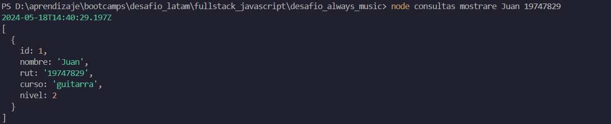

# ALWAYS_MUSIC

Desafio evaluado en bootcamp Fullstack Javascript en Desafio Latam

## Descripción del proyecto

Proyecto que implementa conexion a base de datos a través de node y paquete pg, en donde se resgistran estudiantes, editan, eliminan y muestran.

## Capturas de Pantalla del Proyecto

Vista de estudiante consultado por rut


Vista de todos los estudiantes


## Prerrequisitos o Dependencias

Se necesita las dependencias dotenv y pg.

## Instalación del Proyecto


```bash
npm init -y
```


```bash
npm i express pg dotenv pg
```

## Instrucciones para Ejecutar el Proyecto

Ejecutar la instruccón que quiera realizar

```bash
node consultas agregar Nicolas 19747829 guitarra 5
```
```bash
node consultas mostrar
```
```bash
node consultas consulta Nicolas 19747829
```
```bash
node consultas editar Nicolas 19747829 piano 2
```
```bash
node consultas eliminar 19747829
```

```

## Licencia

Este proyecto está bajo la Licencia MIT - ve el archivo [LICENSE.md](LICENSE) para detalles